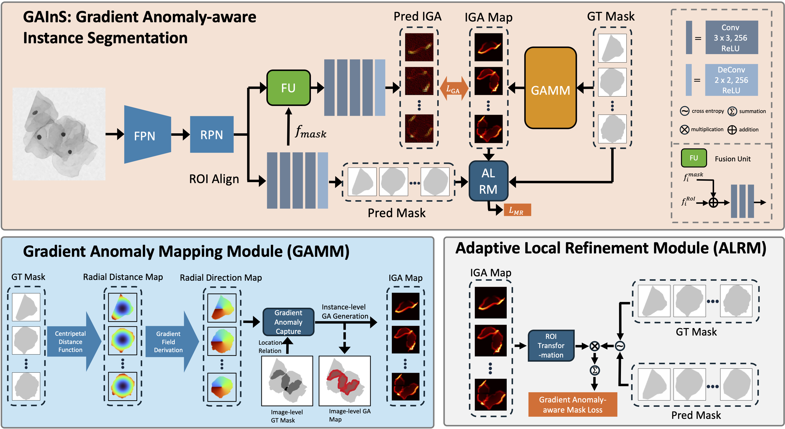
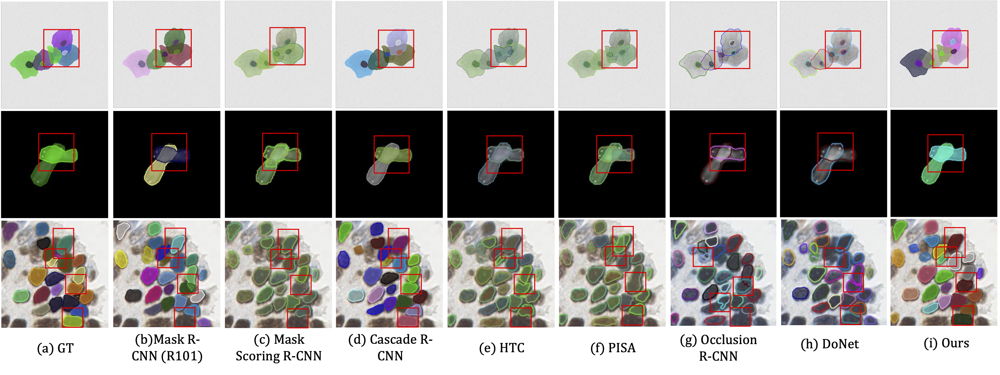

# GAInS: Gradient Anomaly-aware Biomedical Instance Segmentation [IEEE BIBM 2024]

## Introduction

### Abstract
Instance segmentation plays a vital role in the morphological quantification of biomedical entities such as tissues and cells, enabling precise identification and delineation of different structures. Current methods often address the challenges of touching, overlapping or crossing instances through individual modeling, while neglecting the intrinsic interrelation between these conditions.
In this work, we propose a **G**radient **A**nomaly-aware Biomedical **In**stance **S**egmentation approach **GAInS**, which leverages instance gradient information to perceive local gradient anomaly regions, thus modeling the spatial relationship between instances and refining local region segmentation. Specifically, Gradient Anomaly is defined as a kind of local directional anomaly upon multiple gradient directions or conflict of gradient directions among pixels. GAInS is firstly built on a Gradient Anomaly Mapping Module (GAMM), which encodes the radial fields of instances through window sliding to obtain instance gradient anomaly maps. To efficiently refine boundaries and regions with gradient anomaly attention, we propose an Adaptive Local Refinement Module (ALRM) with a gradient anomaly-aware loss function.
Extensive comparisons and ablation experiments in three biomedical scenarios demonstrate that our proposed GAInS outperforms other state-of-the-art (SOTA) instance segmentation methods.
### Overview

### Qualitative Result

